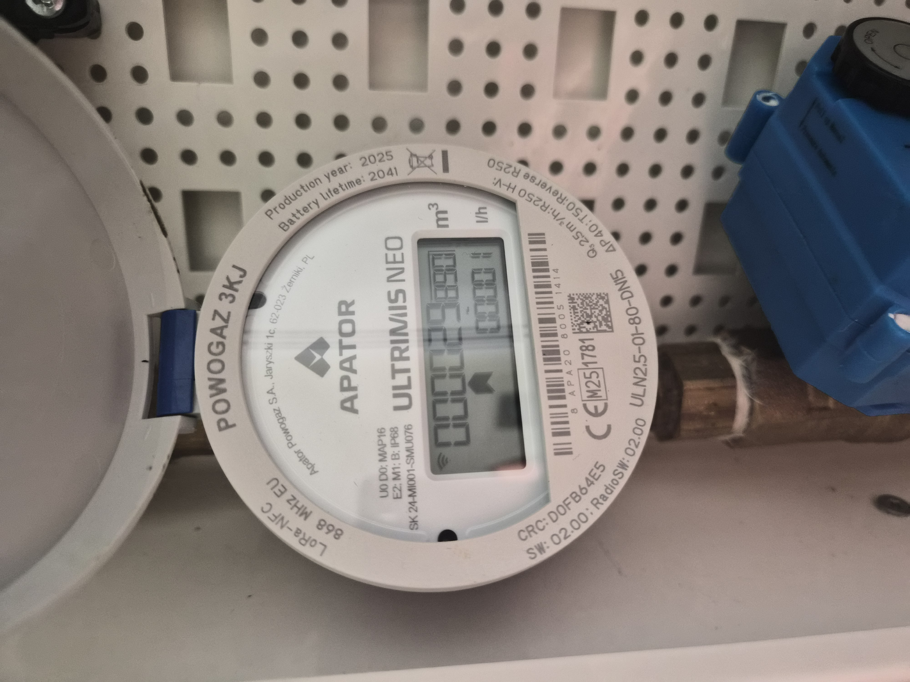
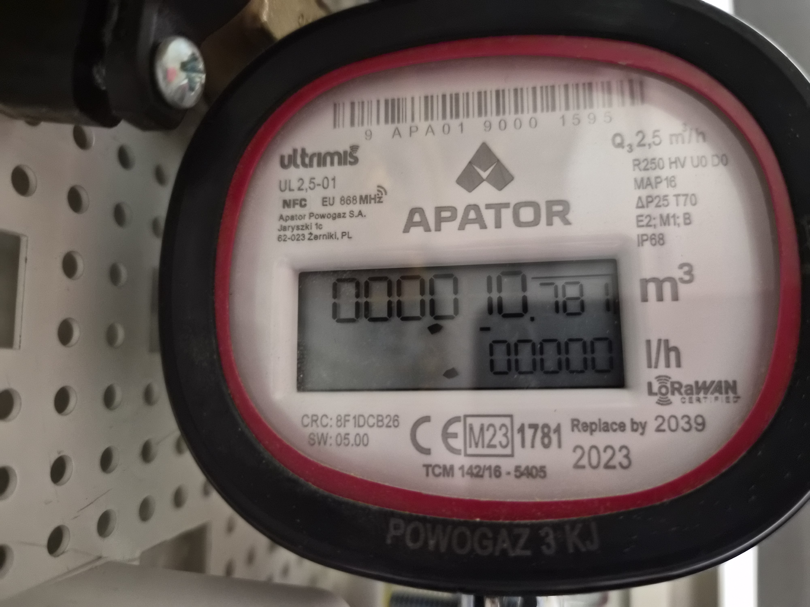

# Slik sender du inn vannmåleravlesning — Møllebakken 36

## Kort fortalt

1. Ta bilde av **begge vannmålerne** (kaldtvann og varmtvann) med mobilen.
2. Send bildene på e-post til **mollebakken.36.vann@gmail.com**.
3. Skriv leilighetsnummeret ditt i emnefeltet, f.eks. **«Vannmåler L3»**.
4. Du får automatisk svar når avlesningen er lagret.

## Gode bilder

- Hele displayet og strekkoden skal være synlig.
- Godt lys, ingen refleks eller skygge over tallene.
- Ett bilde per måler er nok.

Slik skal bildene se ut:

| Kaldtvann | Varmtvann (rød ring) |
| :---: | :---: |
| {width=48%} | {width=48%} |

## Emnefeltet

Systemet må vite hvilken leilighet avlesningen gjelder:

| Skriv | Betyr |
| --- | --- |
| `Vannmåler L1` … `Vannmåler L9` | Leilighet 1–9 |
| `Hovedmåler` eller `Vannmåler L0` | Byggets hovedmåler |

Sender du fra e-postadressen som er registrert på leiligheten din, forstår
systemet det som regel også uten leilighetsnummer — men ta med nummeret for
sikkerhets skyld.

## Svaret du får

- **Lagret:** «Kjære L3, Vi har lagret din vannmåleravlesning …» med tallene
  som ble lest av. Sjekk at de stemmer med måleren din.
- **Allerede registrert:** Sender du samme e-post på nytt, får du svar med
  verdiene som allerede er lagret.
- **Mangler noe:** Svaret forteller hva som mangler (bilder, leilighetsnummer)
  — send på nytt med det som etterspørres.
- **Uklare bilder:** Ta nye bilder med bedre lys og send på nytt.

Får du ikke svar i løpet av kort tid, er meldingen ikke behandlet ennå —
den blir plukket opp ved neste kjøring.

## Spørsmål?

Kontakt styret.
